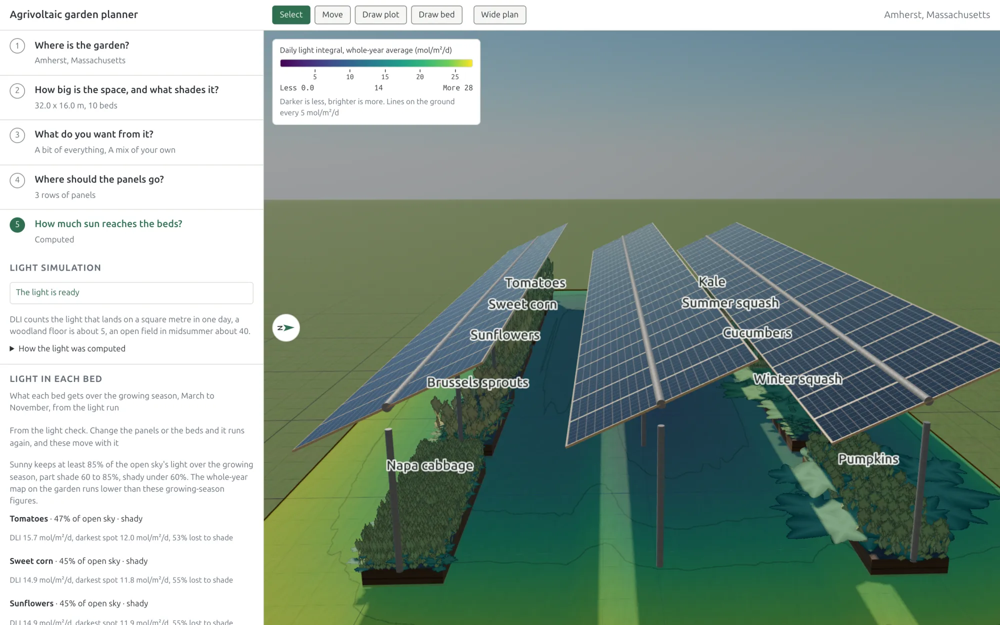

# Agrivoltaic garden planner

A site-specific model of the light a solar array leaves on the ground, and of which crops that light
still supports. Every quantitative claim carries its source, and a figure that rests on an inference
is labeled as inferred.

**[Live app](https://garden.peterklingelhofer.com)** · [Modeling documents](https://garden.peterklingelhofer.com/docs/)

[](https://garden.peterklingelhofer.com)

You give it a place and a rough rectangle. It looks up that site's sun, weather and soil, simulates
how much light reaches the ground once panels are over it, and computes which crops still suit each
bed and what to plant when. The tool shows a trade-off: every panel that generates electricity takes
light off the ground, and the app measures what that costs.

It works at **garden scale**: beds a person can reach across, paths a wheelbarrow fits down,
arrays of a few rows. Farm planning is out of scope: it models no tractor or implement access.
Treat the outputs as planning estimates from a model. Nothing here is agronomic or engineering
advice, and nothing has been validated against a real garden.

The modeling documents behind it are published with the app at
[garden.peterklingelhofer.com/docs/](https://garden.peterklingelhofer.com/docs/), built from `docs/`
by `scripts/render-docs.mjs`. That script carries a whitelist: the science and provenance documents
are published and the internal engineering notes aren't.

## Running it

Requires bun 1.2+ and Node 20+. Bun is enforced: npm, yarn and pnpm are refused by a preinstall
check. Node runs the `scripts/*.mjs` tools, and bun runs the unit suite.

```sh
bun install
bun run dev          # app on :5173, without the conversational panel
```

The chat panel is off in `bun run dev` and in a deployed build. `VITE_AGENT=on bun run dev` turns it
on. `src/agent/flag.ts` has the rule and the reason it's off.

Under plain `bun run dev` the dev server proxies weather (Open-Meteo) and place-name lookups
(Nominatim, Photon) straight to their upstreams, so a site resolves with nothing else running.
`dev-proxy.ts` holds the proxy table. PVGIS, NSRDB and the EIA retail price route through the
Cloudflare Worker, and with no worker listening those requests fail and the app uses its fallbacks.
To exercise them run the worker too:

```sh
bun run dev:worker   # worker on :8787, proxied from the dev server
```

## Checks

```sh
bun run typecheck
bun run lint
bun run test         # bun test
bun run test:e2e     # playwright
bun run check        # biome, writes fixes
```

`bun run generate` re-renders the citation corpus. `docs/CITATIONS.md` and
`src/types/citation-ids.generated.ts` are both derived from `docs/CITATIONS.csl.json`, so a
citekey missing from the corpus is a compile error.

## Where things are

| Path | What lives there |
|---|---|
| `src/scene/` | three.js and react-three-fiber: geometry, lighting, the light overlay, the render pipeline |
| `src/sim/` | the light simulation and the compliance checks |
| `src/recommend/` | crop ranking, polyculture suggestions, and the layout search behind "Show me some layouts" |
| `src/state/` | the zustand store, persistence, and the bridges between the store and the engines |
| `src/ui/` | the ten-step sidebar and its panels, and the design system in `src/index.css` |
| `src/data/` | the crop catalog, companion rules, citations, and the upstream data clients |
| `workers/` | the Cloudflare Worker proxy |
| `e2e/` | Playwright suites, including first-time-user personas |

## Reading further

`docs/` carries the reasoning:

- `docs/ARCHITECTURE.md`, `docs/00-DECISIONS.md`: how it's put together and why
- `docs/VALIDATION.md`: which numbers have been checked against something outside the app
- `docs/STATIC-LAYERS.md`: the bundled climate grids
- `docs/CITATIONS.md`: the corpus, with verification status and evidence tier per source

## Status

CI runs on every push to `main` and every pull request: typecheck, lint, format, the unit suite, the
Rust crate checks, the production build, and the functional Playwright project. Two tests skip on
the runner because it has no real GPU, one each in `e2e/example.spec.ts` and
`e2e/specular-occlusion.spec.ts`.

## License

The code is under the Apache License 2.0 (`LICENSE`). The documents in `docs/` and the data in
`data/` and `public/data/` are under CC BY 4.0 (`LICENSE-DOCS`). Third-party datasets keep their own
terms, listed in `public/data/manifest.json`. Third-party code transcribed into the repository is
credited in `NOTICE`. To cite the project, use `CITATION.cff`.
